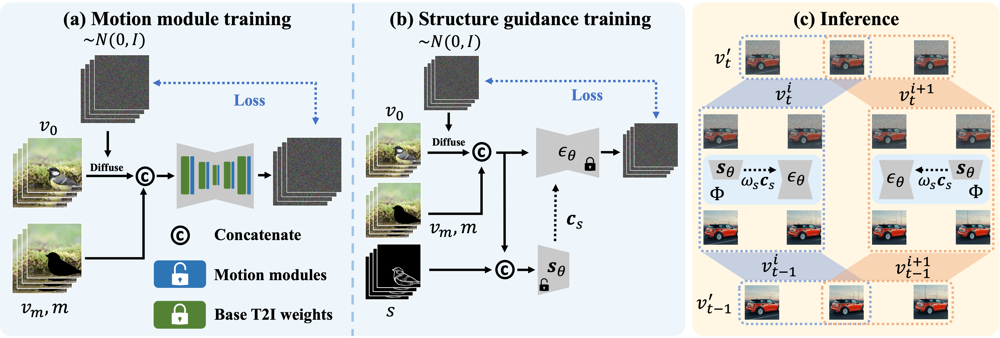

# AVID <br><sub> Any-Length Video Inpainting with Diffusion Model </sub>


[](https://arxiv.org/abs/2312.03816)
[](https://zhang-zx.github.io/AVID)
[](https://zhang-zx.github.io/AVID/supp/index.html)

This respository contains the code for the paper [AVID: <ins>A</ins>ny-Length <ins>V</ins>ideo <ins>I</ins>npainting with <ins>D</ins>iffusion Model](https://arxiv.org/pdf/2312.03816.pdf).
For more visualization results, please check our [supplementary materils](https://zhang-zx.github.io/AVID/supp/index.html).

> **[AVID: <ins>A</ins>ny-Length <ins>V</ins>ideo <ins>I</ins>npainting with <ins>D</ins>iffusion Model](https://arxiv.org/abs/2312.03816)** \
> [Zhixing Zhang](https://zhang-zx.github.io/) <sup>1</sup>,
> [Bichen Wu](https://scholar.google.com/citations?user=K3QJPdMAAAAJ&hl) <sup>2</sup>,
> [Xiaoyan Wang](https://xiaoyan.horizonian.com/) <sup>2</sup>,
> [Yaqiao Luo](https://scholar.google.com/citations?user=be4sU3cAAAAJ) <sup>2</sup>,
> [Luxin Zhang](https://lucinezhang.github.io/) <sup>2</sup>,
> [Yinan Zhao](https://yinan-zhao.github.io/) <sup>2</sup>,
> [Peter Vajda](https://sites.google.com/site/vajdap) <sup>2</sup>,
> [Dimitris Metaxas](https://people.cs.rutgers.edu/~dnm/) <sup>1</sup>,
> and [Licheng Yu](https://lichengunc.github.io/) <sup>2</sup> \
> <sup>1</sup> Rutgers University
> <sup>2</sup> Meta AI

<div align="center">
    <a></a>
</div>

**AVID** is a a video inpainting method versatile across a spectrum of video durations and tasks.

> Recent advances in diffusion models have successfully enabled text-guided image inpainting.
While it seems straightforward to extend such editing capability into video domain, there has been fewer works regarding text-guided video inpainting.
Given a video, a masked region at its initial frame, and an editing prompt, it requires a model to do infilling at each frame following the editing guidance while keeping the out-of-mask region intact.
There are three main challenges in text-guided video inpainting: ($i$) temporal consistency of the edited video, ($ii$) supporting different inpainting types at different structural fidelity level, and ($iii$) dealing with variable video length.
To address these challenges, we introduce Any-Length Video Inpainting with Diffusion Model, dubbed as AVID.
At its core, our model is equipped with effective motion modules and adjustable structure guidance, for fixed-length video inpainting.
Building on top of that, we propose a novel Temporal MultiDiffusion sampling pipeline with an middle-frame attention guidance mechanism, facilitating the generation of videos with any desired duration. 
Our comprehensive experiments show our model can robustly deal with various inpainting types at different video duration range, with high quality.

## Acknowledgement

This codebase is built on top of [diffusers](https://github.com/huggingface/diffusers), [AnimateDiff](https://github.com/guoyww/AnimateDiff), and [Tune-A-Video](https://github.com/showlab/Tune-A-Video).
We thank the authors for their great works.

## Reference

If our work helps you, please consider to cite our paper. Thanks!

```BibTeX
@article{zhang2023avid,
  title={AVID: Any-Length Video Inpainting with Diffusion Model},
  author={Zhang, Zhixing and Wu, Bichen and Wang, Xiaoyan and Luo, Yaqiao and Zhang, Luxin and Zhao, Yinan and Vajda, Peter and Metaxas, Dimitris and Yu, Licheng},
  journal={arXiv preprint arXiv:2312.03816},
  year={2023}
}
```
